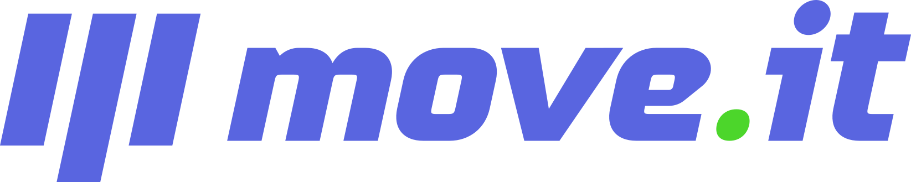

<h1 align="center">
  
</h1>

<h3 align="center">
  Move.it - Always remember to exercise
</h3>

<p align="center">
  <a href="https://www.linkedin.com/in/eliasgcf/"></a>
  
  <a href="https://github.com/EliasGcf/moveit/commits/master"></a>
  
</p>

<p align="center">
  <a href="#-about-the-project">About the project</a> •
  <a href="#-layout">Layout</a> •
  <a href="#-technologies">Technologies</a> •
  <a href="#-getting-started">Getting started</a> •
  <a href="#license">License</a>
</p>

<p align="center">
  
</p>

## 💪 About the project

[Move.it](https://moveit-dvgzi74h1-eliasgcf.vercel.app/) is here to remind you to exercise on work! 💜

This is a project developed during the **[Next Level Week #04](https://nextlevelweek.com/)**, presented by **[@Rocketseat](https://github.com/Rocketseat)** during February 22-28, 2021.

## 🔖 Layout

You can view the project layout through the links below:

- [Layout Web](https://www.figma.com/file/ge20pu3ofMOKoliUyKx1Nl/Move.it-1.0)

Remembering that you need to have a [Figma](http://figma.com/) account to access it.

## 🚀 Technologies

- [ReactJS](https://reactjs.org/)
- [TypeScript](https://www.typescriptlang.org/)
- [Next.js](https://nextjs.org/)

## 💻 Getting started

### Requirements

- [Node.js](https://nodejs.org/en/)
- [Yarn](https://classic.yarnpkg.com/)

**Clone the project and access the folder**

```bash
$ git clone https://github.com/EliasGcf/moveit.git && cd moveit
```

**Follow the steps below**

```bash
# Install the dependencies
$ yarn

# Start the app
$ yarn start
```

## 📝 License

This project is licensed under the MIT License - see the [LICENSE](LICENSE) file for details.

---

<p align="center">
  Made with 💜&nbsp; by <a href="https://www.linkedin.com/in/eliasgcf/">Elias Gabriel</a>
</p>
